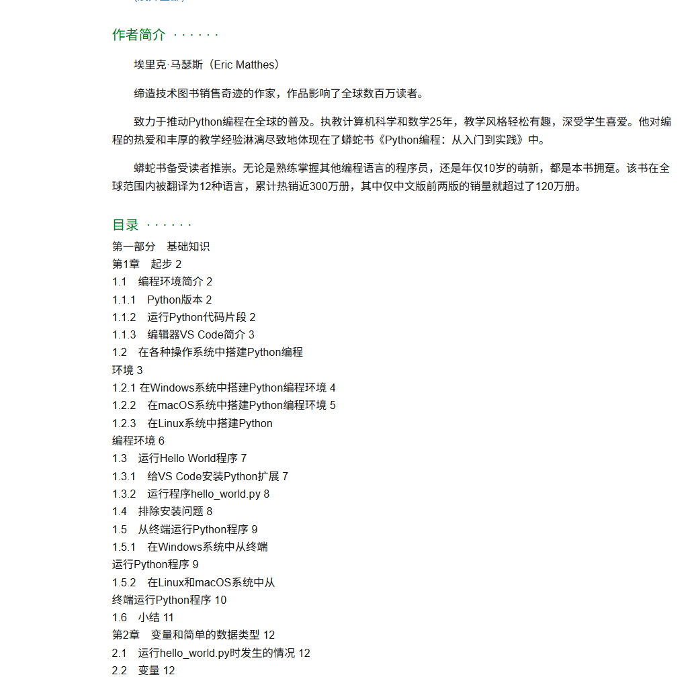
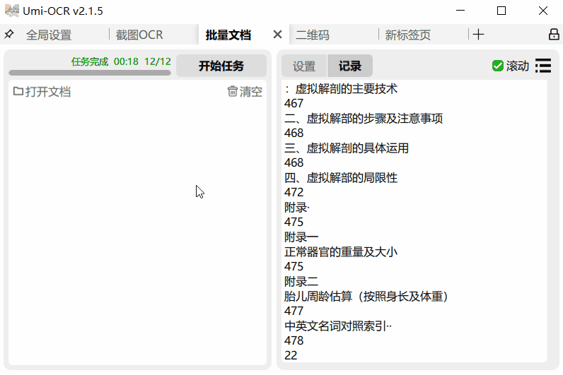

##使用FreePic2Pdf制作目录教程
1. 首先获取每个章节对应的页数
	- 例如去豆瓣、京东等网上找
	- 找不到如果是可直接复制的pdf那就直接复制目录和页码
	- 以上都不行也可以用UmiOCR的`批量文档`功能，选定目录那几页批量识别目录页，此时获取的文本还不能直接使用。
	- 通过AI帮我们整理格式，先手动做一段示例，如图的格式，
	  一级标题置顶，二级标题缩进一个制表符，三级标题缩进两个制表符，以此类推，并且页码要和文字用一个空格隔开，
	  ==重点：1、让AI不要写程序，直接按照给的示例输出结果，
	  2、在示例中，ocr识别出来什么就输入什么，输出就是你要的东西，按上述要求把输出调整好。
	  3、有时AI不按你的要求输入，不要客气，直接指正它并让他重新输出，如图==
	
2. 上述步骤后我们应该已经获得规范的目录了，首先打开`PdgCntEditor.exe`,将我们的目录文本粘贴上去后，按步骤点击，它就把页码切分好了
3. 将切分好内容复制，打开`FreePic2Pdf.exe`，接着如图操作就制作完毕啦
